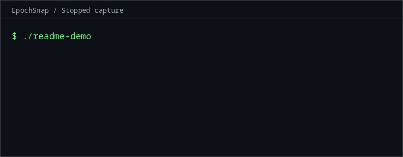

# EpochSnap

EpochSnap is a **Rust/Linux same-process checkpoint and rewind engine** for an
explicitly managed `AtomicU64` arena, restored to the same mapping.
**Stopped** capture pauses the owner for the full copy. **WriteProtected** capture
uses **Linux `userfaultfd` write protection (UFFD WP)**: the owner resumes after
the entire arena is protected while a worker saves each page before allowing its
first post-boundary write. This is **arena rewind, not CRIU or full process
checkpointing**.

The measured benefit is a **2.4–4.2× shorter median checkpoint-call pause** across
the initial 16/64/256 MiB benchmark matrix. Total capture took longer and write
latency increased. These are instrumented measurements from one machine, not a
general performance guarantee. [Results and methodology](docs/benchmarks.md#measured-results-2026-10-04).


## Scope

EpochSnap checkpoints uniform `AtomicU64` slots in one fixed private anonymous
arena, then restores that arena **inside the same running process**. It is not
CRIU, full process checkpointing, arbitrary Rust heap serialization, or durable
process restart. Stacks, threads, ordinary heap objects, open files and external
effects do not rewind. The application must put replay state (including logical
time and RNG state) in the arena and capture between complete logical operations.

## Capture flow

Two capture modes share the same atomic copy routine:

- **Stopped:** the owner stays paused until every slot is copied. This is the
  reference path and works without `userfaultfd`.
- **WriteProtected:** the owner resumes after the entire mapping is armed.
  Writes to unsaved pages may block until the worker saves them. Wait for the
  complete image before inspecting or restoring it.

The checkpoint boundary is established after full write protection and before
the owner resumes. One worker services faults and scans; each page is saved
once, before it becomes writable. A ready image requires every page saved,
the UFFD context closed and the worker joined. Atomic slot access supplies Rust
race freedom; Linux WP preserves the boundary image. [Safety contract](docs/design.md).

## Measured checkpoint pause

Representative **64 MiB** results from 2026-10-04, with all four workloads shown.
Each value is the median of ten fresh-process trials per mode. The pause includes
the complete checkpoint call, including WP worker setup, registration and arming.

| Workload | Stopped pause (ms) | WP pause (ms) | Stopped / WP |
| --- | ---: | ---: | ---: |
| Read-heavy | 8.092 | 2.288 | 3.54× |
| Sparse writes | 8.633 | 2.575 | 3.35× |
| Clustered writes | 8.808 | 2.286 | 3.85× |
| Sequential writes | 8.908 | 2.416 | 3.69× |

Across the initial matrix, WP owner-observed readiness took **6.1–11.0× longer**
than stopped. Sparse throughput fell to **15.8–19.5%** of stopped; sequential
throughput fell to **73.5–74.4%**. Read-heavy and clustered throughput improved
over stopped, but all WP workloads had worse operation p99. The measured host
was a Ryzen 5 5600 with 4096-byte pages, Fedora Linux `7.2.8-100.fc43.x86_64`
and Rust 1.96.1. [Full results, contention controls, memory costs and raw trials](docs/benchmarks.md#measured-results-2026-10-04).

## Usage

```rust
use epochsnap::{Arena, CaptureMode};

fn main() -> epochsnap::Result<()> {
    let mut arena = Arena::new(1)?; // capacity rounds up to whole base pages
    arena.store_word(0, 42)?;
    let epoch = arena.checkpoint(CaptureMode::Stopped)?;
    arena.store_word(0, 99)?;
    assert_eq!(arena.checkpoint_words(epoch)?[0], 42);
    arena.restore(epoch)?;
    assert_eq!(arena.load_word(0)?, 42);
    arena.discard_checkpoint(epoch)?; // required before the next capture
    Ok(())
}
```

For concurrent capture, select `CaptureMode::WriteProtected` and call
`arena.wait_checkpoint(epoch)?` before reading or restoring the image. You can
also poll `checkpoint_status` for `Pending { saved_pages, total_pages }` or
`Ready { metrics }`. Ready metrics include copied bytes, fault/scanner page
counts, capture boundary and readiness offsets, and optional worker elapsed/CPU
time. Stopped capture is immediately ready.

The arena contains uniform `AtomicU64` slots in one fixed private anonymous
mapping. Loads return copied values; mutation and lifecycle calls require
`&mut Arena`. It is movable between threads, non-cloneable and not `Sync`.
Only the completed image can be borrowed as a slice. There is one retained
checkpoint and one reusable image buffer; discard before taking another one.
A ready checkpoint can be restored repeatedly until discarded. Wrong-arena and
stale epochs are rejected.

Atomic slots alone do not make a compound record atomic. Simultaneous mutators,
dynamic growth and incremental images are outside the scope.

Pending image access and restore return `Error::Pending`. Capability errors
report the failed operation or missing feature, with no stopped fallback.
Unexpected active capture failures poison the arena. Cancellation returns it to
usable only after successful teardown and worker join.

## Demo



Deterministic stopped-mode capture and same-process restore through the public
API. Frames use reading pauses, not performance timings.
[Regenerate](scripts/render_demo.py) with `python3 scripts/render_demo.py`
(Python 3, Pillow and a monospaced font; see the script for prerequisites).

## Build and test

Use stable Rust with edition 2024 support on Linux/x86-64 (tested with Rust
1.96.1). Install Rust/Cargo and a system linker/C toolchain first. `Cargo.lock`
pins the sole dependency, `libc`; build-time kernel headers are not required.
The first build needs access to the Cargo registry unless dependencies are cached.

From a fresh checkout:

```sh
git clone https://github.com/memosmorgan/epoch-snap.git
cd epoch-snap
cargo build --locked --all-targets
cargo test --locked --all-targets
cargo test --locked --doc
cargo run --locked --example rewind -- --mode stopped --arena-mib 1
```

Ordinary tests cover stopped capture, bounds, tokens, restore/replay, ownership
restrictions, example CLI/CSV and child-local seccomp denial. They do not require
UFFD. [Test coverage and validation records](docs/testing.md).

### Check concurrent-mode support

```sh
cargo run --locked --bin epochsnap -- doctor
```

`doctor` checks features and anonymous WP registration; it does not exercise a
protected write. A nonzero exit explains unavailable features or a denied syscall.
Stopped mode still works. Containers and recent kernels can deny UFFD through
seccomp or LSM policy; there is no privileged or stopped fallback for WP.

The 39 real-kernel tests and one WP example smoke test are explicitly ignored in
ordinary runs. On an intended WP host, run them separately:

```sh
cargo test --locked --test linux_uffd -- --ignored
cargo test --locked --release --test linux_uffd -- --ignored
cargo test --locked --test examples -- --ignored
cargo test --locked --release --test examples -- --ignored
```

These commands fail usefully when UFFD is unavailable. Subprocess deadlines
contain test hangs; they do not establish production latency bounds.

## Benchmark and replay

```sh
epochsnap_bench_dir=$(mktemp -d)
cargo run --locked --release --example bench -- --arena-mib 64 --workload sparse --seed 1 --trials 10 --output "$epochsnap_bench_dir/sparse.csv"
cargo run --locked --release --example rewind
```

The benchmark runs ten fresh-process trials for each of `none`, `stopped` and
`wp`, shuffling their order. The output path must be a new file. Workloads are
`read-heavy`, `sparse`, `clustered` and `sequential`. The default demo captures
step 128, advances to step 1408, restores and replays identical inputs, comparing
every slot. [Benchmark protocol and CSV fields](docs/benchmarks.md).

On a host without UFFD, select stopped mode explicitly:

```sh
epochsnap_stopped_dir=$(mktemp -d)
cargo run --locked --release --example bench -- --arena-mib 1 --workload sequential --trials 1 --modes none,stopped --output "$epochsnap_stopped_dir/stopped.csv"
cargo run --locked --release --example rewind -- --mode stopped --arena-mib 1
```

To reproduce the full 480-trial matrix, including CPU placement and contention
controls, follow the [matrix workflow and prerequisites](docs/benchmarks.md#reproduce-the-matrix).

## Supported hosts

Linux/x86-64 is supported, using runtime base pages. Linux 6.6+ is the intended
baseline, subject to runtime probes; compatibility with 6.6 and other hosts
remains unverified. Recent kernels can still deny UFFD through seccomp or LSM
policy. Run `doctor` and the explicit kernel tests on the intended host.

The recorded validation host is Fedora Linux `7.2.8-100.fc43.x86_64`, Rust
1.96.1, 4096-byte pages, AMD Ryzen 5 5600 and 15.5 GiB RAM. All 39 kernel cases
passed in debug and release on 2026-10-04. Stress coverage includes 1001 WP
captures with 500 queued-fault cancellations and 1000 stopped cycles.

[Linux CI](.github/workflows/linux.yml) checks formatting, Clippy, ordinary
targets and doctests on Ubuntu x86-64. It has no established UFFD-capable runner,
so its intended coverage is ordinary tests only. The checks passed locally;
GitHub Actions runs currently stop before executing them. Remote CI validation
remains pending.

[Architecture and safety contract](docs/design.md) ·
[Testing](docs/testing.md) · [Benchmarks](docs/benchmarks.md)

[MIT licensed](LICENSE).
